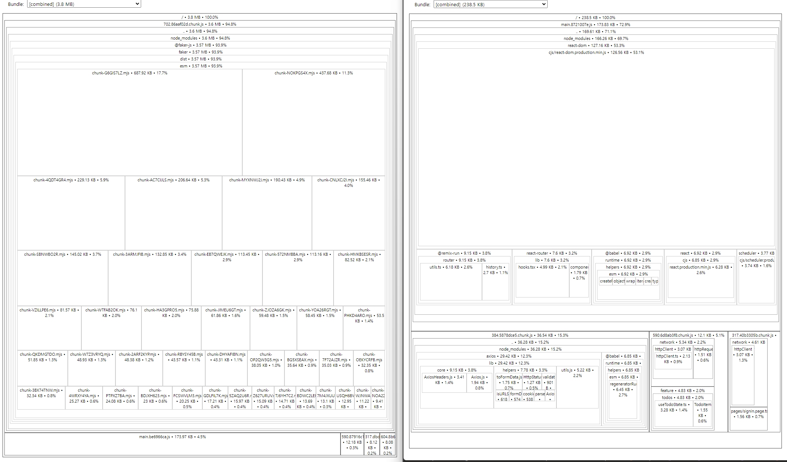
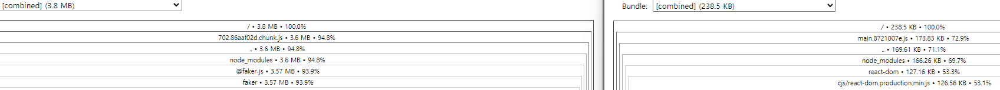

# 원티드 프리온보딩 프론트엔드 - 선발 과제

> 지원자: 이윤상

## 사용 스택

- typescript
- react.js (cra)
- react-router-dom
- axios
- msw (api request mocking)
- react-error-boundary
- tailwindcss
- source-map-explorer (bundle analysis)

## 프로젝트 실행

```bash
# 프로젝트 세팅 및 실행
npm install & npm start
```

## 배포 주소

#### http://wanted-preonboarding-assignment-lee-yoonsang.s3-website.ap-northeast-2.amazonaws.com

## 프로젝트 구조 설명

 ``` 
 .msw - http api mock.
 
 feature - 각 기능 별로 사용되는 기능을 모두 담아둠.
 
 layout - 사이트 레이아웃.
 
 network - http api 관련 기능.
  ㄴ httpRequest - api request wrapper.
  ㄴ spec - api 관련 정보 및 typedef.
  
 pages - page 들.
 
 state - shared 상태.
```

## CD

- Github Action -> "deploy" branch on push 에 trigger.
- AWS S3 의 static website hosting 이용.

## Bundle Analysis



- 좌: @faker-js/faker 사용 시 번들 사이즈 - 3.8mb (자동으로 제거 안됨!)
- 우: 제거 후 번들사이즈 - 238.5kb
- 차이 : 3.56mb..

### faker (+ 다른 dev library) 는 production 에서 잘 뺍시다.